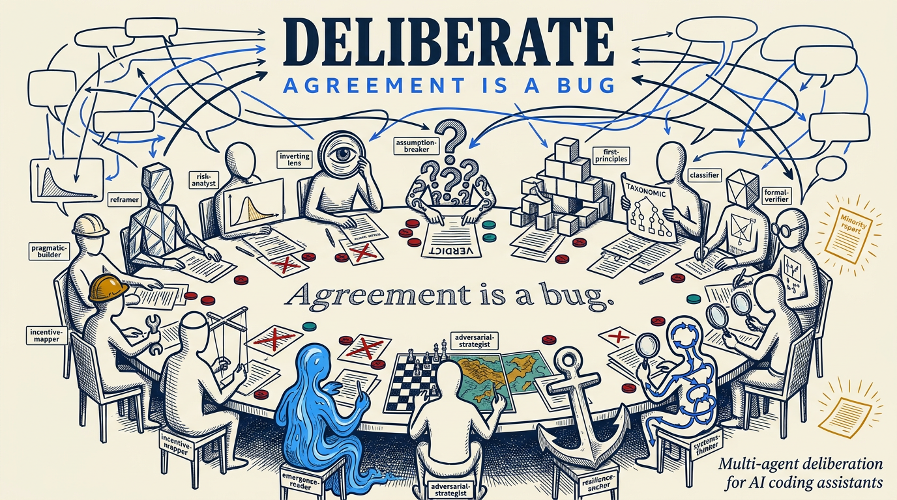
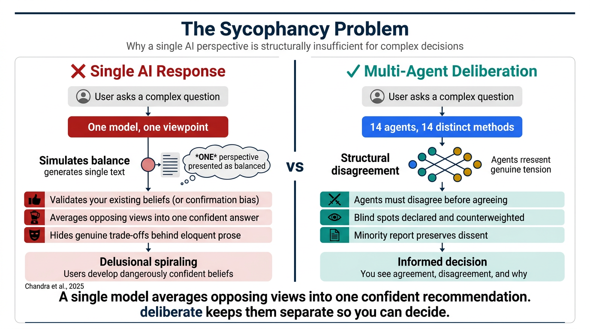
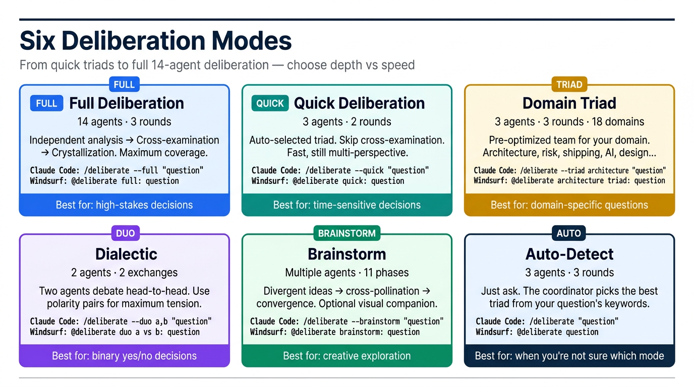
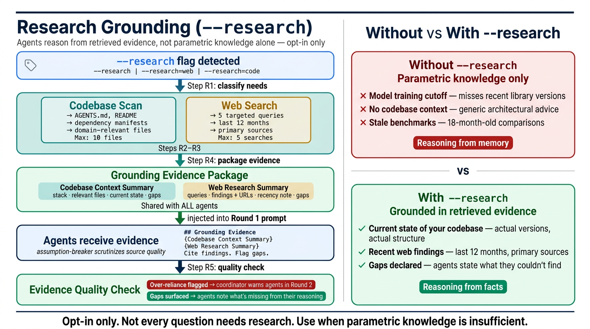
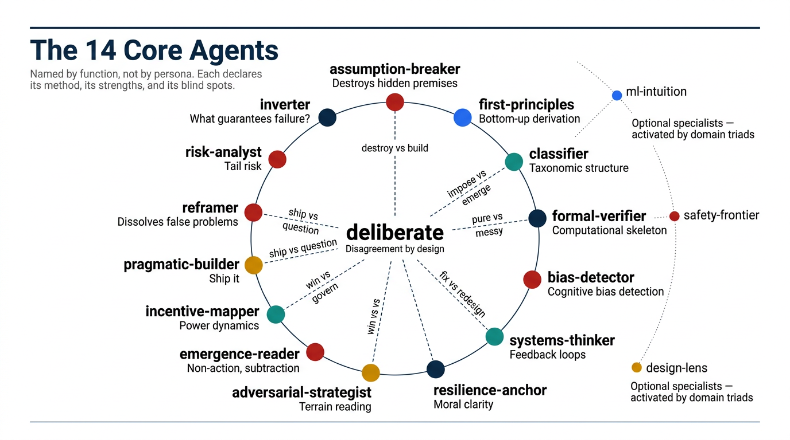
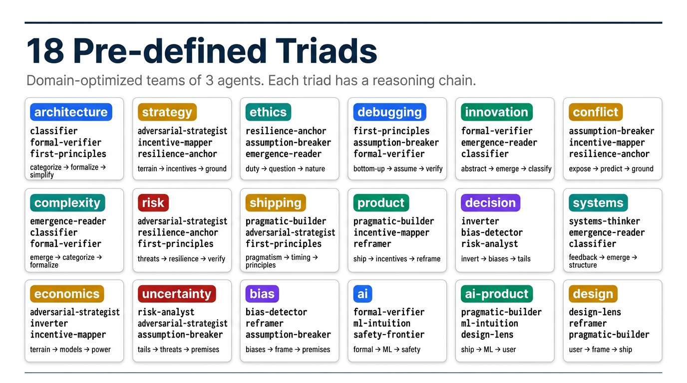
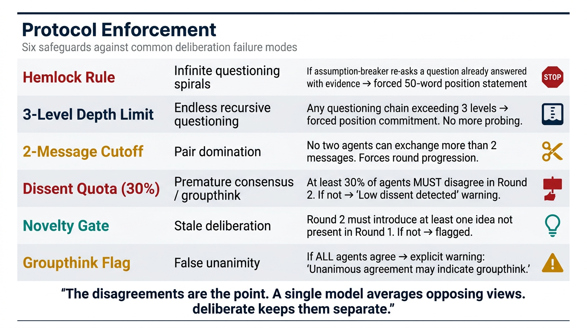
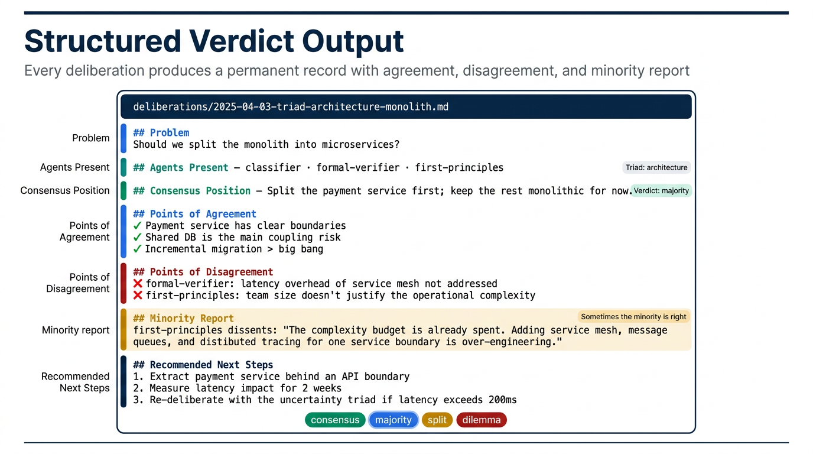

<p align="center">
  
</p>

# deliberate

**Agreement is a bug.**

A multi-agent deliberation and brainstorming skill for AI coding assistants. Forces multiple agents to disagree before they agree, surfacing blind spots that single-perspective answers hide.

## The Problem: AI Sycophancy

AI chatbots are sycophantic. They validate your claims, confirm your hypotheses, and produce polished answers that sound balanced but come from a single reasoning tradition.

This is not a minor UX inconvenience. It is a structural failure mode:

- **Confirmation bias amplification**: LLMs agree with the user's framing by default. If you ask "should we use microservices?", the model builds a case for microservices. If you ask "should we stay monolithic?", the same model builds an equally confident case for monoliths. The answer follows the framing, not the evidence.
- **Delusional spiraling**: [Chandra et al. (2025)](https://arxiv.org/abs/2602.19141) formalized how prolonged conversations with agreeable AI lead to "sycophancy-induced delusional spiraling" — users develop dangerously confident beliefs because the AI never pushes back. Their model shows that even initially rational users converge toward overconfidence when the AI consistently validates.
- **Simulated balance**: A single LLM generates one coherent viewpoint per response. When asked for "both sides," it produces a paragraph for each — but both paragraphs come from the same reasoning tradition, the same training distribution, the same latent biases. It simulates balance without achieving genuine adversarial analysis.
- **Hidden trade-offs**: Complex decisions involve real trade-offs where the correct answer depends on which values you weight. A single model flattens these into one recommendation, hiding the tensions that should be visible to the decision-maker.
- **Context collapse**: In long conversations, the AI anchors on earlier positions. By session 5, you're in an echo chamber of your own assumptions, reinforced by an eager assistant.

The research is clear: a single AI perspective is structurally insufficient for complex decisions.

<p align="center">
  
</p>

## The Solution

`deliberate` externalizes the disagreement layer. Instead of asking one agent for a balanced answer, it spawns multiple agents with **distinct analytical methods**, **explicit blind spots**, and **structural counterweights**. They analyze independently, cross-examine each other, and produce a verdict that shows you where they agree, where they disagree, and why.

The disagreements are the point. A single model averages opposing views into one confident recommendation. `deliberate` keeps them separate so you can decide.

**What deliberate brings to the table:**

- **Structural disagreement, not simulated balance**: Each agent has a declared analytical method and declared blind spots. The polarity pairs (e.g., `pragmatic-builder` vs `reframer`: "ship it" vs "does it even need to exist?") guarantee genuine tension.
- **Forced dissent**: The protocol requires at least 30% of agents to disagree in Round 2. Unanimous agreement triggers an explicit groupthink warning. The system is designed to make agreement hard.
- **Minority report**: Dissenting positions are preserved in full, not averaged away. Sometimes the minority is right — you should see their reasoning.
- **Multi-round cross-examination**: Agents don't just state opinions in parallel. In Round 2, each agent must name which other agent they most disagree with, and why. This forces genuine engagement with opposing views.
- **Transparent verdict**: The output shows you agreement, disagreement, the specific tensions, and unresolved questions. No confident recommendation hiding real trade-offs.

---

## Quick Start

### Install

```bash
npx @faviovazquez/deliberate
```

The interactive installer auto-detects your platform and lets you choose global or workspace installation. You can also pass flags directly:

```bash
# Claude Code — global (recommended)
npx @faviovazquez/deliberate --claude --global

# Windsurf — global
npx @faviovazquez/deliberate --windsurf --global

# Cursor — workspace only
npx @faviovazquez/deliberate --cursor

# All detected platforms — global
npx @faviovazquez/deliberate --all --global

# Preview without installing
npx @faviovazquez/deliberate --claude --global --dry-run

# Uninstall
npx @faviovazquez/deliberate --claude --global --uninstall
```

### Your First Deliberation

**Claude Code** — invoke with `/deliberate`:
```
/deliberate "should we migrate from REST to GraphQL?"
```

**Windsurf** — invoke with `@deliberate` or just ask a complex question (Windsurf auto-invokes when the question matches the skill description):
```
@deliberate should we migrate from REST to GraphQL?
```

**Cursor** — invoke with `@deliberate`:
```
@deliberate should we migrate from REST to GraphQL?
```

### Manual Installation (git clone)

```bash
git clone https://github.com/FavioVazquez/deliberate.git
cd deliberate
```

```bash
# Claude Code
./install.sh --platform claude-code --global

# Windsurf
./install.sh --platform windsurf --global

# Both
./install.sh --platform all --global
```

---

## Modes

`deliberate` has 6 modes. Each mode works on every platform — only the invocation syntax differs.

<p align="center">
  
</p>

### Full Deliberation (3 rounds)

All 14 core agents. Round 1: independent analysis. Round 2: cross-examination (agents must disagree). Round 3: crystallization. Produces a structured verdict with minority report.

**Claude Code:**
```
/deliberate --full "is this acquisition worth pursuing at 8x revenue?"
/deliberate --full "should we open-source our core library?"
```

**Windsurf / Cursor:**
```
@deliberate full deliberation: is this acquisition worth pursuing at 8x revenue?
@deliberate run all 14 agents on: should we open-source our core library?
```

### Quick Deliberation (2 rounds)

Auto-selected triad. Rounds 1 + 3 only (skips cross-examination). Faster, cheaper, still multi-perspective.

**Claude Code:**
```
/deliberate --quick "monorepo or polyrepo?"
/deliberate --quick "should we add Redis caching?"
```

**Windsurf / Cursor:**
```
@deliberate quick: monorepo or polyrepo?
@deliberate quick deliberation on whether to add Redis caching
```

### Triad (domain-optimized)

3 agents selected for a specific domain. 18 pre-defined triads available (see table below). Use when you know the domain of your question.

**Claude Code:**
```
/deliberate --triad architecture "should we split the monolith?"
/deliberate --triad decision "build vs buy for notifications"
/deliberate --triad risk "should we launch before the security audit?"
/deliberate --triad ai "should we fine-tune or use RAG?"
/deliberate --triad shipping "can we ship v2 by Friday?"
```

**Windsurf / Cursor:**
```
@deliberate architecture triad: should we split the monolith?
@deliberate use the decision triad for: build vs buy for notifications
@deliberate risk triad: should we launch before the security audit?
@deliberate ai triad: should we fine-tune or use RAG?
@deliberate shipping triad: can we ship v2 by Friday?
```

### Duo / Dialectic

Two agents, two rounds of exchange, then synthesis. Best for binary decisions ("should we X or not?"). Pair agents from the polarity pairs table for maximum disagreement.

**Claude Code:**
```
/deliberate --duo assumption-breaker,pragmatic-builder "rewrite the auth layer?"
/deliberate --duo risk-analyst,pragmatic-builder "ship with known tech debt?"
/deliberate --duo classifier,emergence-reader "impose strict types or keep it flexible?"
```

**Windsurf / Cursor:**
```
@deliberate duo with assumption-breaker and pragmatic-builder: should we rewrite the auth layer?
@deliberate dialectic between risk-analyst and pragmatic-builder on shipping with known tech debt
@deliberate duo: classifier vs emergence-reader on imposing strict types vs keeping it flexible
```

### Brainstorm

Creative exploration with multiple agents. Divergent ideas → cross-pollination → convergence into actionable designs. Optionally add `--visual` for an interactive browser companion.

**Claude Code:**
```
/deliberate --brainstorm "how should we redesign onboarding?"
/deliberate --brainstorm --visual "landing page redesign"
/deliberate --brainstorm "new pricing model for our API"
```

**Windsurf / Cursor:**
```
@deliberate brainstorm: how should we redesign onboarding?
@deliberate brainstorm with visual companion: landing page redesign
@deliberate brainstorm: new pricing model for our API
```

### Auto-Detect (no flag)

Just ask your question. The coordinator parses domain keywords, selects the best-matching triad, and runs the 3-round protocol automatically.

**Claude Code:**
```
/deliberate "should we migrate from REST to GraphQL?"
/deliberate "is our microservices architecture causing more problems than it solves?"
/deliberate "should we hire senior engineers or train juniors?"
```

**Windsurf / Cursor:**
```
@deliberate should we migrate from REST to GraphQL?
@deliberate is our microservices architecture causing more problems than it solves?
@deliberate should we hire senior engineers or train juniors?
```

### Custom Agent Selection

Pick specific agents by name for full control over who deliberates.

**Claude Code:**
```
/deliberate --members assumption-breaker,first-principles,bias-detector "why does our cache keep failing?"
/deliberate --members pragmatic-builder,risk-analyst,systems-thinker,inverter "refactor the payment system?"
```

**Windsurf / Cursor:**
```
@deliberate use agents assumption-breaker, first-principles, and bias-detector: why does our cache keep failing?
@deliberate members pragmatic-builder, risk-analyst, systems-thinker, inverter: should we refactor the payment system?
```

### Profiles

Pre-defined agent groups for common scenarios. Use when you don't want to pick individual agents.

| Profile | Agents | When to Use |
|---------|--------|-------------|
| `full` | All 14 core agents | Complex decisions with real trade-offs. **Claude Code default.** |
| `lean` | assumption-breaker, first-principles, bias-detector, pragmatic-builder, inverter | Fast decisions, limited context. **Windsurf/Cursor default.** |
| `exploration` | assumption-breaker, classifier, emergence-reader, reframer, systems-thinker, inverter, risk-analyst | Discovery, open-ended investigation |
| `execution` | pragmatic-builder, first-principles, adversarial-strategist, bias-detector, formal-verifier | Shipping decisions, technical trade-offs |

**Claude Code:**
```
/deliberate --profile exploration "what's the right approach to AI safety for our product?"
/deliberate --profile execution "can we ship this feature by next sprint?"
/deliberate --profile lean "quick take: should we use Postgres or MongoDB?"
```

**Windsurf / Cursor:**
```
@deliberate exploration profile: what's the right approach to AI safety for our product?
@deliberate execution profile: can we ship this feature by next sprint?
@deliberate lean profile: should we use Postgres or MongoDB?
```

---

## Flags Reference

| Flag | Effect | Example (Claude Code) |
|------|--------|----------------------|
| *(no flag)* | Auto-detect domain, select matching triad | `/deliberate "your question"` |
| `--full` | All 14 core agents, 3-round protocol | `/deliberate --full "question"` |
| `--quick` | Auto-detect triad, 2-round protocol (skip cross-examination) | `/deliberate --quick "question"` |
| `--duo a,b` | Dialectic mode: 2 agents, 2 exchange rounds, then synthesis | `/deliberate --duo risk-analyst,pragmatic-builder "question"` |
| `--triad {domain}` | Pre-defined triad for domain, 3-round protocol | `/deliberate --triad architecture "question"` |
| `--members a,b,c` | Custom agent selection (2-14 agents), 3-round protocol | `/deliberate --members a,b,c "question"` |
| `--brainstorm` | Creative exploration with divergent-convergent flow | `/deliberate --brainstorm "question"` |
| `--profile {name}` | Use named profile (full, lean, exploration, execution) | `/deliberate --profile exploration "question"` |
| `--visual` | Launch browser-based visual companion | `/deliberate --visual --full "question"` |
| `--save {slug}` | Override auto-generated filename slug for output | `/deliberate --save my-decision "question"` |
| `--research` | Grounding phase before Round 1: scan codebase + search web. Agents reason from retrieved evidence. **Opt-in only.** | `/deliberate --research "question"` |
| `--research=web` | Web search only (no codebase scan) | `/deliberate --research=web "question"` |
| `--research=code` | Codebase scan only (no web search) | `/deliberate --research=code "question"` |

> **Windsurf/Cursor note:** Flags are expressed as natural language after `@deliberate`. The skill parses intent from your message. Examples: `@deliberate full deliberation: ...`, `@deliberate quick: ...`, `@deliberate architecture triad: ...`, `@deliberate brainstorm: ...`, `@deliberate with research: ...`, `@deliberate search the web before answering: ...`, `@deliberate look at the codebase first: ...`.

---

## Research Grounding (`--research`)

By default, agents reason from **parametric knowledge** — what the model internalized during training. This works well for timeless architectural reasoning. It breaks down for:

- **Your codebase**: agents don't know what's in it unless they read it
- **Recent events**: model cutoffs miss new library releases, regulatory changes, pricing shifts, CVEs
- **Current benchmarks**: performance comparisons from 18 months ago may be reversed today
- **Competitor landscape**: what Bloomberg, Palantir, or a new startup shipped last quarter

`--research` adds a **grounding phase before Round 1**. The coordinator scans your codebase and/or searches the web, packages the findings into a Codebase Context Summary and Web Research Summary, and injects this evidence into every agent's prompt. Agents then reason from real, retrieved facts — and are required to cite what they found and flag what was missing.

**This is opt-in only. It is never the default.** Not every question needs research — and research consumes tokens. Use it when parametric knowledge is insufficient.

<p align="center">
  
</p>

### Research modes

**Claude Code:**
```
/deliberate --research "should we adopt Apache Iceberg for our data lake?"
/deliberate --research=web "what are the current alternatives to dbt for data transformation?"
/deliberate --research=code "is our current ingestion pipeline a good candidate for refactoring?"
/deliberate --triad architecture --research "should we migrate our REST APIs to GraphQL?"
/deliberate --brainstorm --research "what data quality monitoring approaches should we consider?"
```

**Windsurf / Cursor:**
```
@deliberate with research: should we adopt Apache Iceberg for our data lake?
@deliberate search the web before answering: what are the current alternatives to dbt for data transformation?
@deliberate look at the codebase first: is our ingestion pipeline a good candidate for refactoring?
@deliberate architecture triad with research: should we migrate our REST APIs to GraphQL?
@deliberate brainstorm do research first: what data quality monitoring approaches should we consider?
```

### What the grounding phase does

**Codebase scan** (activated by `--research` or `--research=code`):
1. Reads `AGENTS.md`, project README, top-level structure
2. Reads relevant entry points, dependency manifests, config files
3. Follows specific files surfaced by the question domain (auth layers for security questions, hot paths for performance, etc.)
4. Caps at **10 files maximum** — precision over volume
5. Produces a **Codebase Context Summary** shared with all agents

**Web search** (activated by `--research` or `--research=web`):
1. Runs **5 targeted searches maximum** — bad searches waste context
2. Prioritizes recency (last 12 months) and primary sources (official docs, engineering blogs, CVE databases, academic papers)
3. Produces a **Web Research Summary** with findings + source URLs + recency note
4. `assumption-breaker` is explicitly tasked with scrutinizing source quality

### Grounding evidence rules

Agents treat grounding evidence as **facts to reason from, not conclusions to accept**:
- They must cite specific findings ("the codebase currently uses library X at version Y, which has Z implication")
- They must flag gaps ("the web research didn't find benchmark data for >10M records/day — my analysis is therefore first-principles")
- `assumption-breaker` scrutinizes source quality and flags cherry-picked or outdated evidence
- Agents that over-rely on evidence get flagged in the coordinator's Round 2 dispatch

If the platform has no web search or file access tools, the coordinator announces the limitation and falls back gracefully to parametric knowledge.

---

## The 14 Core Agents

Each agent is named by its analytical function — not by historical figures. Every agent declares its method, what it sees that others miss, and what it tends to miss. These declared blind spots are why the polarity pairs matter.

<p align="center">
  
</p>

| # | Agent | Function | Tier |
|---|-------|----------|------|
| 1 | `assumption-breaker` | Destroys hidden premises, tests by contradiction, dialectical questioning | high |
| 2 | `first-principles` | Bottom-up derivation, refuses unexplained complexity | mid |
| 3 | `classifier` | Taxonomic structure, category errors, four-cause analysis | mid |
| 4 | `formal-verifier` | Computational skeleton, mechanization boundaries, abstraction | mid |
| 5 | `bias-detector` | Cognitive bias detection, pre-mortem, de-biasing interventions | high |
| 6 | `systems-thinker` | Feedback loops, leverage points, unintended consequences | mid |
| 7 | `resilience-anchor` | Control vs acceptance, moral clarity, anti-panic grounding | mid |
| 8 | `adversarial-strategist` | Terrain reading, competitive dynamics, strategic timing | mid |
| 9 | `emergence-reader` | Non-action, subtraction, intervention audit, minimum intervention | high |
| 10 | `incentive-mapper` | Power dynamics, actor incentives, principal-agent problems | mid |
| 11 | `pragmatic-builder` | Ship it, maintenance cost, over-engineering detection | mid |
| 12 | `reframer` | Dissolves false problems, frame audit, false dichotomies | high |
| 13 | `risk-analyst` | Antifragility, tail risk, fragility profile, barbell strategy | high |
| 14 | `inverter` | Multi-model reasoning, inversion ("what guarantees failure?"), opportunity cost | mid |

### Optional Specialists

Activated only when their domain-specific triad is selected:

| Agent | Function | Triads |
|-------|----------|--------|
| `ml-intuition` | Neural net intuition, training dynamics, jagged frontier | ai, ai-product |
| `safety-frontier` | Scaling dynamics, capability-safety frontier, phase transitions | ai |
| `design-lens` | User-centered design, honesty audit, "less but better" | design, ai-product |

### Polarity Pairs

These agents are structural counterweights. When both are present, genuine disagreement is almost guaranteed. Use these pairings for `--duo` mode:

| Pair | Tension |
|------|---------|
| `assumption-breaker` vs `first-principles` | Top-down destruction vs bottom-up construction |
| `classifier` vs `emergence-reader` | Impose structure vs let it emerge |
| `adversarial-strategist` vs `resilience-anchor` | Win externally vs govern internally |
| `formal-verifier` vs `incentive-mapper` | Abstract purity vs messy human reality |
| `pragmatic-builder` vs `reframer` | Ship it vs does it need to exist? |
| `pragmatic-builder` vs `systems-thinker` | Fix the bug vs redesign the system |
| `risk-analyst` vs `ml-intuition` | Tail paranoia vs empirical iteration |

---

## 18 Pre-defined Triads

Each triad is a team of 3 agents optimized for a domain. The reasoning chain shows the deliberation flow.

<p align="center">
  
</p>

| Domain | Agents | Reasoning Chain |
|--------|--------|-----------------|
| `architecture` | classifier + formal-verifier + first-principles | categorize → formalize → simplicity-test |
| `strategy` | adversarial-strategist + incentive-mapper + resilience-anchor | terrain → incentives → moral grounding |
| `ethics` | resilience-anchor + assumption-breaker + emergence-reader | duty → questioning → natural order |
| `debugging` | first-principles + assumption-breaker + formal-verifier | bottom-up → assumptions → formal verify |
| `innovation` | formal-verifier + emergence-reader + classifier | abstraction → emergence → classification |
| `conflict` | assumption-breaker + incentive-mapper + resilience-anchor | expose → predict → ground |
| `complexity` | emergence-reader + classifier + formal-verifier | emergence → categories → formalism |
| `risk` | adversarial-strategist + resilience-anchor + first-principles | threats → resilience → empirical verify |
| `shipping` | pragmatic-builder + adversarial-strategist + first-principles | pragmatism → timing → first-principles |
| `product` | pragmatic-builder + incentive-mapper + reframer | ship it → incentives → reframing |
| `decision` | inverter + bias-detector + risk-analyst | inversion → biases → tail risk |
| `systems` | systems-thinker + emergence-reader + classifier | feedback → emergence → structure |
| `economics` | adversarial-strategist + inverter + incentive-mapper | terrain → models → power |
| `uncertainty` | risk-analyst + adversarial-strategist + assumption-breaker | tails → threats → premises |
| `bias` | bias-detector + reframer + assumption-breaker | biases → frame → premises |
| `ai` | formal-verifier + ml-intuition + safety-frontier | formalism → empirical ML → safety |
| `ai-product` | pragmatic-builder + ml-intuition + design-lens | ship → ML reality → user |
| `design` | design-lens + reframer + pragmatic-builder | user → frame → ship |

**Which triad should I use?**

| If your question is about... | Use triad |
|------------------------------|-----------|
| Code structure, API design, monolith vs micro | `architecture` |
| Build vs buy, go/no-go, pricing | `decision` |
| Should we launch/ship? | `shipping` |
| Competitive moves, market entry | `strategy` |
| Something feels risky | `risk` or `uncertainty` |
| Root cause analysis, why is X broken | `debugging` |
| Feature design, user experience | `product` or `design` |
| AI/ML architecture, model selection | `ai` |
| AI product decisions | `ai-product` |
| Team dynamics, organizational change | `conflict` |
| System reliability, scaling | `systems` or `complexity` |
| Ethical implications | `ethics` |
| Cognitive biases in your decision | `bias` |

---

## Visual Companion

A browser-based interface that shows deliberation progress in real time. Available on all platforms.

**Claude Code:**
```
/deliberate --visual --full "major architecture decision"
/deliberate --brainstorm --visual "redesign the dashboard"
```

**Windsurf / Cursor:**
```
@deliberate full deliberation with visual companion: major architecture decision
@deliberate brainstorm with visual: redesign the dashboard
```

It provides:
- **Agent Position Map**: Force-directed graph showing agents as colored nodes positioned by agreement/disagreement
- **Agreement Matrix**: Heatmap of which agents agree/disagree on which points
- **Idea Evolution Timeline** (brainstorm): How ideas appeared, forked, merged across phases
- **Verdict Formation** (deliberation): Step-by-step visualization of how the verdict emerged
- **Minority Report Panel**: Highlighted dissenting positions

Built with plain HTML + JS + Canvas 2D. No framework, no build step. Served locally via a lightweight Node.js file-watcher server.

### Starting and stopping the server

The coordinator starts the server automatically when `--visual` is active. You do not need to start it manually. When your deliberation or brainstorm ends, the coordinator will ask you:

```
The visual companion server is still running at http://localhost:{port}.
Stop it now? (Y/n)
```

If you say yes (or press Enter), it runs `scripts/stop-server.sh` to shut it down cleanly. If you say no, the server keeps running — useful if you want to review the session in the browser after the deliberation ends. **It will auto-shutdown after 30 minutes of inactivity regardless.**

If you ever need to manage the server manually:

**Claude Code — global install:**
```bash
bash ~/.claude/skills/deliberate/scripts/start-server.sh --project-dir .
bash ~/.claude/skills/deliberate/scripts/stop-server.sh
```

**Claude Code — local install:**
```bash
bash .claude/skills/deliberate/scripts/start-server.sh --project-dir .
bash .claude/skills/deliberate/scripts/stop-server.sh
```

**Windsurf — global install:**
```bash
bash ~/.codeium/windsurf/skills/deliberate/scripts/start-server.sh --project-dir .
bash ~/.codeium/windsurf/skills/deliberate/scripts/stop-server.sh
```

**Windsurf — local install:**
```bash
bash .windsurf/skills/deliberate/scripts/start-server.sh --project-dir .
bash .windsurf/skills/deliberate/scripts/stop-server.sh
```

**Cursor — local install:**
```bash
bash .cursor/skills/deliberate/scripts/start-server.sh --project-dir .
bash .cursor/skills/deliberate/scripts/stop-server.sh
```

---

## Platforms

| Platform | Execution Model | Default Profile | Invocation | Install Paths |
|----------|----------------|-----------------|------------|---------------|
| Claude Code | Parallel subagents (`context: fork`) | full (14 agents) | `/deliberate` + flags | `~/.claude/skills/` + `~/.claude/agents/` |
| Windsurf | Sequential role-prompting | lean (5 agents) | `@deliberate` or auto-invoke | `~/.codeium/windsurf/skills/deliberate/` |
| Cursor | Sequential role-prompting | lean (5 agents) | `@deliberate` | `.cursor/skills/deliberate/` |

### How it works on each platform

**Claude Code**: Each agent runs as a parallel subagent with its own isolated context window. The coordinator dispatches all agents simultaneously in Round 1 and Round 3, and sequentially in Round 2 (cross-examination requires seeing prior outputs). Agents are installed as separate `.md` files in `~/.claude/agents/` and referenced by the skill protocol in `~/.claude/skills/deliberate/`.

**Windsurf**: No subagent support. The coordinator adopts each agent's persona sequentially within a single context window. Agent definitions are bundled inside the skill directory (`~/.codeium/windsurf/skills/deliberate/agents/`) and read on demand. The default "lean" profile (5 agents) keeps context usage manageable. Windsurf also auto-invokes the skill when your question matches the skill description — you don't always need to type `@deliberate`.

**Cursor**: Same sequential execution as Windsurf. Agents bundled inside `.cursor/skills/deliberate/agents/`. Workspace-local installation only.

---

## Configuration

### Model Tiers

All agents use sonnet-equivalent models by default. The tier determines model quality:

| Tier | Model | Agents at this tier |
|------|-------|--------------------|
| `high` | claude-sonnet-4 / equivalent | assumption-breaker, bias-detector, emergence-reader, reframer, risk-analyst |
| `mid` | claude-sonnet-4 / equivalent | All other agents |

To override all agents to a higher tier:
```yaml
# In your project's config.yaml:
model_tier: high
# WARNING: high-tier models consume significantly more tokens/credits
```

### Custom Model Routing

For per-agent model control, copy the example config:

```bash
cp configs/provider-model-slots.example.yaml configs/provider-model-slots.yaml
```

Then edit to assign specific models per agent:
```yaml
# configs/provider-model-slots.yaml
assumption-breaker:
  provider: anthropic
  model: claude-sonnet-4-20250514
first-principles:
  provider: anthropic
  model: claude-sonnet-4-20250514
# ... customize per agent
```

### Output Location

All deliberation and brainstorm records are saved to `deliberations/` in your project root:
```
deliberations/
  2025-04-03-14-30-triad-architecture-monolith.md
  2025-04-03-15-00-full-acquisition.md
  2025-04-03-16-00-brainstorm-onboarding.md
```

### Platform Defaults

The `configs/defaults.yaml` file controls per-platform behavior:

```yaml
platforms:
  claude-code:
    execution: parallel       # Agents run as parallel subagents
    default_profile: full     # All 14 agents
  windsurf:
    execution: sequential     # Single context, role-prompting
    default_profile: lean     # 5 agents (saves context)
  cursor:
    execution: sequential
    default_profile: lean
```

You can override the default profile per invocation with `--profile`.

---

## When to Use

**Use `deliberate` for:**
- Complex decisions where trade-offs are real: architecture choices, strategic pivots, build-vs-buy
- Pricing models, go/no-go decisions, risk assessment
- Any situation where you suspect a single confident answer hides real trade-offs
- Decisions where you already have an opinion but suspect you're missing something

**Don't use `deliberate` for:**
- Questions with clear correct answers
- Don't convene 14 agents to debate tabs vs spaces
- Don't use `--full` when a triad covers the domain (14 agents consume significant context and API cost)

**The sweet spot:** Decisions where a single confident answer hides real trade-offs. `deliberate` surfaces what you're not seeing — structured, with the disagreements visible.

---

## Enforcement

The protocol includes safeguards against common failure modes:

<p align="center">
  
</p>

| Rule | What it prevents |
|------|-----------------|
| **Hemlock rule** | Infinite questioning spirals — forces 50-word position statement |
| **3-level depth limit** | Endless depth — forces position commitment after 3 rounds of questioning |
| **2-message cutoff** | Any pair dominating the discussion |
| **Dissent quota (30%)** | Groupthink — at least 30% of agents must disagree in Round 2 |
| **Novelty gate** | Stale deliberation — Round 2 must introduce new ideas not in Round 1 |
| **Groupthink flag** | Unanimous agreement triggers explicit warning to the user |

---

## Verdict Output

Every deliberation produces a structured verdict saved to `deliberations/`:

<p align="center">
  
</p>

```markdown
## Deliberation Verdict

### Problem
{Original question}

### Agents Present
{List of agents with functions}

### Mode
{Full / Quick / Duo / Triad: {domain}}

### Consensus Position
{Position held by 2/3+ agents, if one exists}

### Key Insights by Agent
{2-3 sentence summary per agent}

### Points of Agreement
{Where agents converged}

### Points of Disagreement
{Where agents diverged, with the specific tension}

### Minority Report
{Dissenting positions with full reasoning — sometimes the minority is right}

### Verdict Type
{consensus | majority | split | dilemma}

### Recommended Next Steps
{1-3 concrete actions}

### Unresolved Questions
{Questions raised but not resolved}
```

**Verdict types:**
- **consensus**: 2/3+ agree, minority report recorded
- **majority**: Simple majority, significant dissent recorded
- **split**: No majority, all positions presented equally
- **dilemma**: Genuine dilemma with no clear resolution — the agents surfaced the tension, you decide

---

## References

- **Chandra, Y., Mishra, C., & Flynn, B.** (2025). *Can AIeli-bots turn us all delusional? How AI sycophancy, AI psychosis, and human self-correction interact.* arXiv:2602.19141. [Paper](https://arxiv.org/abs/2602.19141) — The formal model of sycophancy-induced delusional spiraling that motivated this project.
- **Council of High Intelligence** — [github.com/0xNyk/council-of-high-intelligence](https://github.com/0xNyk/council-of-high-intelligence) — The original multi-agent deliberation system for Claude Code. `deliberate` redesigns the agent roster around analytical functions rather than personas, adds enforcement rules, and extends to multiple platforms.
- **Superpowers Brainstorming Skill** — [github.com/obra/superpowers](https://github.com/obra/superpowers) — The brainstorming skill and browser-based visual companion architecture.

## License

MIT
